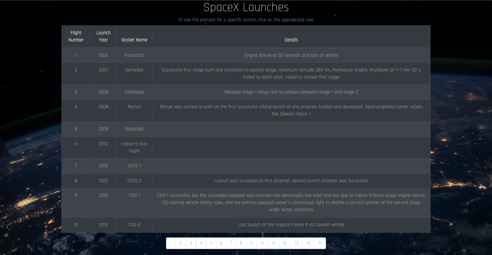

# Space X Launches 🚀

View a list of all SpaceX Launches.\
Deployment: [react-spacex-launches.netlify.app](react-spacex-launches.netlify.app)

## Screenshots

## Features
- Paginate through SpaceX Launches API results
- Click any given row to view presskit for that launch

## Tech Stack

**Client:** [React](https://reactjs.org)\
**Libraries:** [Axios](https://github.com/axios/axios), [React-Boostrap](https://react-bootstrap.github.io)\
**API:** [SpaceX API](https://github.com/r-spacex/SpaceX-API)

## Feedback

If you have any feedback, please [reach out to me](https://www.linkedin.com/in/carrie-mathieu/)

  
## License

[MIT](https://choosealicense.com/licenses/mit/)
